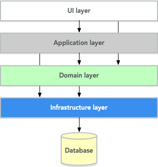
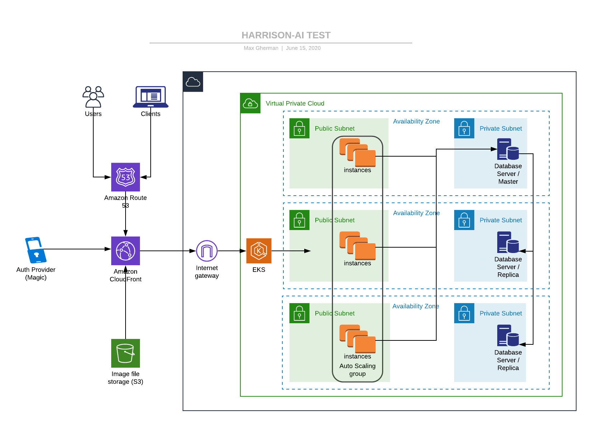

# harrison-ia test

## NodeJs REST APIs for image labeling facilitation

## Description

The project represents a collection of APIs for images and labels management. APIs provide the ability to persist and modify data using REST-full architecture. All presented artifacts are ready for production deployment using corresponding components. End-user scenarios cover following user cases:

* Create label
* Update label text
* Retrieve label by id
* Retrieve all labels
* Create image
* Update image
* Retrieve image metadata by id
* Retrieve all images metadata
* Retrieve specific image contents

## Technical stack

* API implementation language - [TypeScript](https://www.typescriptlang.org/)
* HTTP Server - [NodeJs](https://nodejs.org/)
* API Framework - [ExpressJs](https://expressjs.com/)
* Auth Provider - [Magic](https://magic.link/)
* Image metadata/Labels persistence - [PostgreSQL](https://www.postgresql.org/)
* Image content persistent - [AWS S3](https://aws.amazon.com/s3/)
* Infrastructure implementation language - [CloudFormation](https://aws.amazon.com/cloudformation/)
* Application life-cycle management - [ASW AKS](https://aws.amazon.com/eks/)

## Design decisions

- [x] API architecture - [REST](https://en.wikipedia.org/wiki/Representational_state_transfer)
- [x] Application design
    - API interface - [Model-View-Controller](https://en.wikipedia.org/wiki/Model%E2%80%93view%E2%80%93controller)
    - Business logic - simplified [Onion Architecture](https://www.thinktocode.com/2018/08/16/onion-architecture/)
        - [Service layer pattern](https://en.wikipedia.org/wiki/Service_layer_pattern)
        - [Repository pattern](https://docs.microsoft.com/en-us/dotnet/architecture/microservices/microservice-ddd-cqrs-patterns/infrastructure-persistence-layer-design#the-repository-pattern)
- [x] Authentication
    - Password-less provider based one decentralized tokens
        - [Magic](https://magic.link/)
        - [Tokens](https://docs.magic.link/decentralized-id)
    - Session management - [PassportJs](http://www.passportjs.org/)
- [x] Metadata persistence
    - PostgreSQL - horizontal scalability via multiple replicas https://aws.amazon.com/rds/features/#Scalability
    - Relational schema
- [x] Image content persistent
    - ASW S3 - improves scalability of image ingestion, provides separate APIs and security layers 

### Diagram


 
### APIs

* Create label

```
 * @route POST /labels
 * @param {string} value.body.required - label text
 * @returns {} 201 - label created
 * @returns {} 400 - missing request body specification
 * @returns {Error}  default - Unexpected error
```

* Update label

```
 * @route PUT /labels/:id
 * @param {string} id.query.required - label id
 * @param {string} value.body.required - label text
 * @returns {} 200 - label updated
 * @returns {} 400 - missing request body specification
 * @returns {} 404 - record not found
 * @returns {Error}  default - Unexpected error
```

* Retrieve label by id

```
 * @route GET /labels/:id
 * @param {string} id.query.required - label id
 * @returns {Label} 200 - label found
 * @returns {} 404 - record not found
 * @returns {Error}  default - Unexpected error
```

* Retrieve all labels

```
 * @route GET /labels/
 * @returns {Label[]} 200 - array of labels
 * @returns {Error}  default - Unexpected error
```

* Create image - POST /images

```
 * @route POST /images
 * @param {request} multipart/form-data
 * @param {string[]} labelIds - array of label ids as part of url-encoded form
 * @param {string} status required image status
 * @returns {} 201 - image created
 * @returns {} 400 - missing request body specification
 * @returns {Error}  default - Unexpected error
```

* Update image

```
 * @route PUT /images/:id
 * @param {string} id.query.required - image id
 * @param {string[]} labelIds.body.required - array of label ids
 * @param {string} status.body.required - image status
 * @returns {} 200 - image updated
 * @returns {} 400 - missing request body specification
 * @returns {} 404 - record not found
 * @returns {Error}  default - Unexpected error
```

* Retrieve image metadata by id

```
 * @route GET /images/:id
 * @param {string} id.query.required - label id
 * @returns {Image} 200 - image found
 * @returns {} 404 - record not found
 * @returns {Error}  default - Unexpected error
```

* Retrieve all images metadata

```
 * @route GET /images
 * @returns {Image[]} 200 - array of image metadata
 * @returns {Error}  default - Unexpected error
```

* Retrieve specific image contents

```
 * @route GET /images/:id/contents
 * @returns {Blob} 200 - binary image contents
 * @returns {Error}  default - Unexpected error
```

## Source files outline

* application - application implementation content
    - public - front-end  artifacts
    - src - source files
        - repositories - data persistence layer
        - routes - API controllers
        - services  - service pattern layer
        - utils - cross cutting concerns implementation
            - middleware - express middleware
                - logging
                - global error handling
                - user detection
                - pii detection
            - logger - logging facility
        - `app.ts` - main application file
        - `index.ts` - application entry point            
    - test - test files
    - views - HTML rendering templates
* database - database related script
    - `docker.sh` - PostgreSQL local docker management
    - `schema.sql` - DB Schema scripts
* infrastructure - infrastructure as code content
    - eks - AKS provisioning artifacts
        - aws-auth-cm.yaml - EC2 nodes provisioning script
        - eks-cluster.yaml - cluster
        - eks-cluster-network.yaml - cluster network group
        - eks-nodegroup.yaml - cluster node group
        - k8s.yaml - application container deployment script
    - user - user provisioning artifacts
        - user.yaml - creates user to be used for future infrastructure provisioning

## Local development

- Register application with [Magic](https://magic.link/) provider using preferred email address 
- Navigate to `application` folder
- Create `.env` with the contents from .env.example file. Setup values for all variables
- Start local PostgreSQL container
    - database/docker.sh
- Create DB schema
    - Change provided email address to preferred one. It will be used as an admin account
    - database/schema.sh
    - Populate some sample data (labels, images)
- Install application dependencies, build and run:

```sh
npm i
npm run build
npm start
```

- Navigate to http://localhost:8080
- Login using preferred email address
- Observe results of the calls against above mentioned APIs. Front-end makes several calls but populates all the results to the console.

## Production deployment

- Create separate AWS user using CloudFormation template provided
- Create S3 bucket to store image files (template not provided)
- Create k8s infrastructure sing CloudFormation templates provided
    1.  Cluster network
    2.  Cluster
    3.  Node group
    4.  Authorize nodes against cluster (substitute cluster role and user arn)
- Setup CI/CD pipeline
    1.  Build docker image using Dockerfile provided (set up all environment variables)
    2.  Push docker image to the private registry
    3.  Update k8s.yam file with the image registry path
    4.  Apply k8s.yam deployment
    5.  Setup DNS resolver (for example Route 53) to route traffic into the cluster (template not provided)

Note: Kubernetes network architecture provided consist of the public subnets only. This approach works well for production ready demonstrations. For more secure environments, network architecture has to be altered so nodes could be be placed into private subnets while traffic is routed via a NAT Gateways from public subnets. 

## Infrastructure



## Future enhancements

- [] - Separate front-end and back-end
    * Implement front-end as a separate static React web site
    * Deploy front-end into a separate s3 bucket configured for web hosting
- [] - Image storage
    * Enable s3 versioning to minimize a chance of accidental image deletion
    * Enable s3 encryption using custom master keys for security improvements
- [] - Kubernetes
    * Introduce private subnets for nodes
    * Introduce NAT Gateways for public subnets
    * Assign EC2 nodes separate role with s3 read/write permission to remove AWS credentials form the docker config 
- [] - High performance/scalability
    * Remove PostgreSQL and upload images and metadata directly into s3 using signed URLs
    * Use DynamoDB as a label management store
    * Introduce AWS Glue for ETL services
 